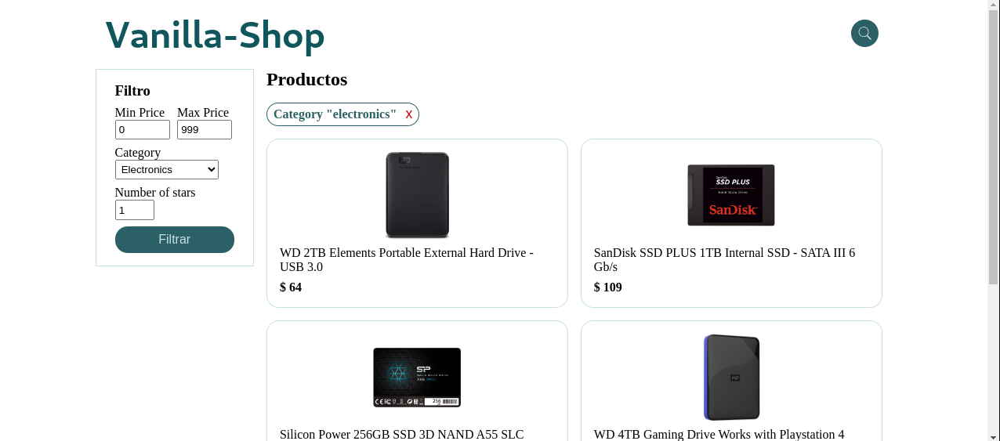

# Vanilla-Shop App


This project is a simple online store built with [Astro](https://astro.build), JavaScript for the client-side scripts, TypeScript for server-side scripts, HTML5, and CSS3. This is an open-source project aiming to provide a practical and straightforward e-commerce platform.

## Project Overview

Currently, the backend of this project utilizes the [Fake Store API](https://fakestoreapi.com/), a free online REST API that provides fake data for e-commerce or shopping websites.

In the future, the project is set to evolve with a backend developed with Bun.js and Express.

## Screenshots


## Getting Started

This section will guide you through setting up the project on your machine for development and testing purposes.

### Prerequisites

You will need [Bun](https://bun.sh/) (or [Node.js](https://nodejs.org/es)) installed on your system.

### Installation and Running the Frontend

Following these steps will set up the project on your system:

1. Clone the repository:
```sh
git clone https://github.com/joseandrestrujillo/vanilla-shop
```
2. Navigate to the /frontend directory:
```sh
cd vanilla-shop/frontend
```
3. Install the project dependencies:
```sh
bun install
```
4. Start the project:
```sh
bun run start
```
The project should now be running at http://localhost:4321.

## Future Development
The plan for future development includes building a backend with Bun and Express to replace the current Fake Store API.

## Contributing
As an open-source project, we welcome contributions of all forms.

If you have an idea or find a bug, please open an issue so we can discuss it. If you wish to contribute code, please open a pull request.

## License
[](./LICENSE)